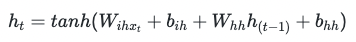
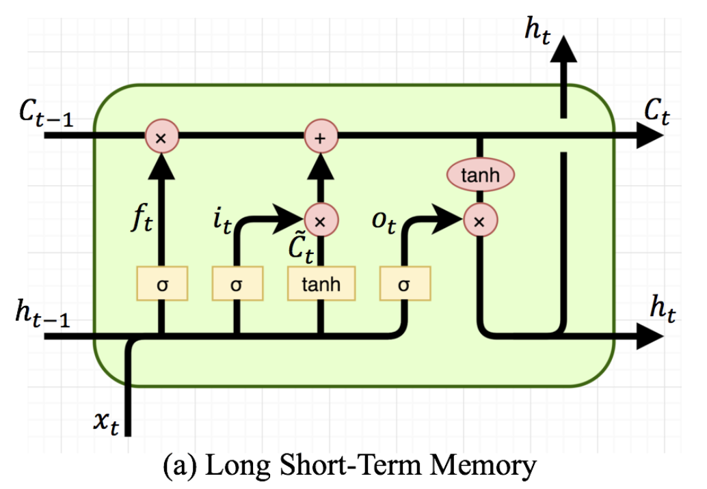
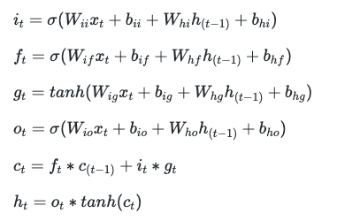

# practice_ML

# Data collection
1) 기존 데이터 
- 기존 nsmc 네이버 리뷰 데이터 중 5000개 추출.

2) 추가 데이터 수집 
- 최신 리뷰 데이터 및 추가 데이터 수집을 위해 리뷰 크롤링

# Data preprocessing
1) labeling
- 스포 -> 1, 스포x -> 0으로 labeling 직접 수행(2명)

스포 기준 
A. 결말 및 숨은 의도 해석 
B. 인물의 죽음, 부활 등 생사여부 포함 
C. 등장 인물간의 관계 및 내용 전개 설명 
D. 반전 언급 
E. 특정 장면에 대한 표현 및 해석 

해당 기준에 하나라도 적용 시 스포로 판단

2) Data Augmentation
- 스포 데이터는 376개, spo가 아닌 데이터는 4624개로 data imbalance현상이 일어나 augmentation을 진행.

3) down sampling 수행 (spo가 아닌 데이터를 spo데이터의 개수로 맞추는 방법)

# modeling
1) RNN
- **RNN**(Recurrent Neural Network), 한국어로는 **순환 신경망**이라 불린다. 자연어는 **시간 정보**가 있는 데이터이므로, RNN 같이 **시간 정보**를 처리 해 주는 신경망이 적합하다고 생각 하여, RNN을 선택하게 되었다.

    
    

- 위 식 처럼, 전 상태의 **hidden state**와 **w_hh** 행렬 곱의 결과, 현 상태의 **input state**와 **w_ih**의 행렬 곱의 결과의 합에 **tanh** 함수를 취한 값을 현 상태의 **hidden state**에 저장 하는 로직을 가지고 있습니다.

- **output**은 현 상태의 **hidden state**와 **w_y**를 곱한 결과입니다.

2) LSTM
- **LSTM**(Long Short-Term Memory)는 일반 **RNN**에서 데이터를 처리 할 때, 문자열이 길어 질 수록, 성능이 저하되는 이슈를 해결 하기 위해 **입력 게이트**, **망각 게이트**, **출력 게이트**를 추가 하여, 불필요한 기억을 지우고, 기억해야 할 정보 들만 남기도록 하는 **개선된 RNN** 입니다. 예를 들어, 군대 선임이 처음 부터 끝까지 나쁜 말만 했는데, 끝에 "잘 하자." 라는 말을 했다고, 군대 선임이 나에게 화가 안났다고 판단하는 것은 문제 일 것입니다. 그런 것처럼, **LSTM**은 기존 RNN에 **Cell State**를 추가하여, 장기 기억을 저장합니다.

    
    

- 첫 번째 사진은 LSTM의 구조, 두 번째 사진은 계산 식입니다.

3) Bert

# Hyper parameter tuning

# conclusion

BERT)
- MAX_len=64, Batch_size=32, lr=2e-5, epoch=20, augmentation O(5개) downsampling X -> 0.98
- MAX_len=64, Batch_size=32, lr=2e-5, epoch=20, augmentation X, downsampling X -> 0.92 => 성능은 높으나 data imbalance
- MAX_len=64, Batch_size=32, lr=2e-5, epoch=20, augmentation X, downsampling O -> 0.75
- MAX_len=64, Batch_size=32, lr=2e-5, epoch=20, augmentation X, downsampling O, add_crawlling -> 0.77
- MAX_len=64, Batch_size=32, lr=2e-5, epoch=20, augmentation O(rd), downsampling O, add_crawlling ->
- MAX_len=64, Batch_size=32, lr=2e-5, epoch=20, augmentation O(ri), downsampling O, add_crawlling ->
- MAX_len=64, Batch_size=32, lr=2e-5, epoch=20, augmentation O(rs), downsampling O, add_crawlling ->
- MAX_len=64, Batch_size=32, lr=2e-5, epoch=20, augmentation O(sr), downsampling O, add_crawlling ->
